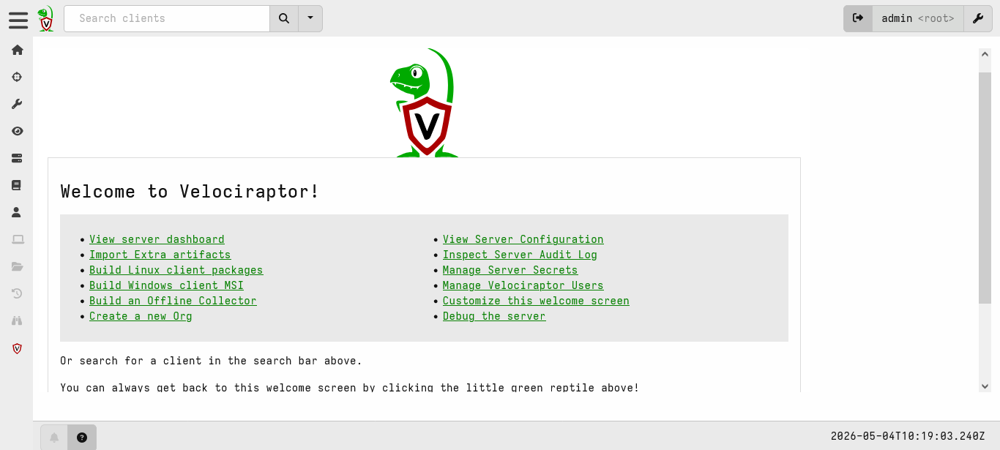
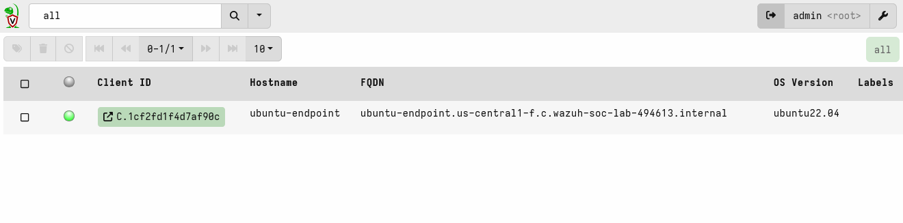
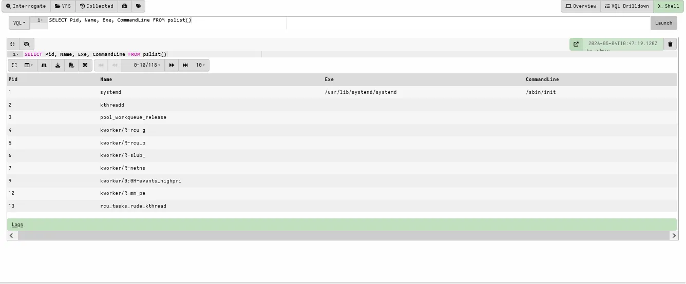
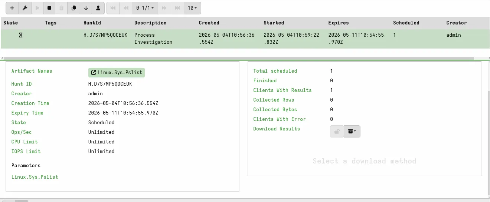
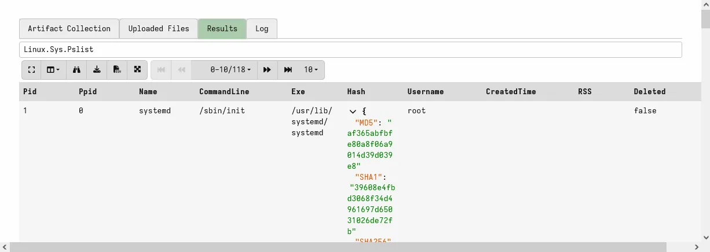
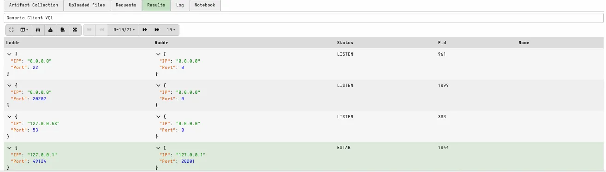

# 🦅 Velociraptor DFIR + Wazuh Integration on GCP


## 📌 Project Overview

This project deploys **Velociraptor** as a Digital Forensics and Incident Response (DFIR) platform on Google Cloud Platform, integrated with an existing Wazuh SIEM stack. It completes a full three-layer SOC detection and investigation pipeline:

| Layer | Tool | Capability |
|---|---|---|
| Network | Suricata IDS 8.0.4 | Intrusion detection + MITRE ATT&CK mapping |
| Host | Wazuh 4.7.5 + VirusTotal | FIM + automated malware removal |
| DFIR | Velociraptor 0.76.1 | Forensic investigation + threat hunting |

---

## 🏗️ Architecture

```
┌─────────────────────────────────────────────┐
│           GCP — us-central1                 │
│                                             │
│  ┌──────────────────┐  ┌─────────────────┐  │
│  │   wazuh-server   │  │ ubuntu-endpoint │  │
│  │  10.128.0.4      │  │  10.128.0.3     │  │
│  │                  │  │                 │  │
│  │ • Wazuh Manager  │  │ • Wazuh Agent   │  │
│  │ • Velociraptor   │◄─┤ • Suricata IDS  │  │
│  │   Server :8000   │  │ • Velociraptor  │  │
│  │ • Dashboard :8889│  │   Client        │  │
│  └──────────────────┘  └─────────────────┘  │
└─────────────────────────────────────────────┘
```

---

## 🎯 Objectives

- Deploy Velociraptor server on existing GCP wazuh-server VM
- Install Velociraptor agent on ubuntu-endpoint
- Run forensic hunts using VQL (Velociraptor Query Language)
- Investigate a simulated malware incident using DFIR techniques
- Correlate Velociraptor findings with Wazuh alerts

---

## 🛠️ Prerequisites

- Completed [Wazuh + VirusTotal Lab](https://github.com/samsonejim/wazuh-virustotal-soc-lab)
- Completed [Suricata IDS + Wazuh Lab](https://github.com/samsonejim/suricata-ids-wazuh-integration)
- GCP project with wazuh-server and ubuntu-endpoint VMs running

---

## 📋 Lab Phases

### Phase 1 — Install Velociraptor Server
- Downloaded Velociraptor v0.76.1 binary
- Generated and configured server config with internal GCP IP
- Installed as system service via .deb package
- Created admin user and accessed dashboard

### Phase 2 — Deploy Velociraptor Agent
- Downloaded same binary on ubuntu-endpoint
- Generated client config pointing to wazuh-server internal IP (10.128.0.4:8000)
- Installed client as system service

### Phase 3 — Verify Connection
- Confirmed ubuntu-endpoint showing Online (green dot) in dashboard
- Ran first VQL query: `SELECT Pid, Name, Exe, CommandLine FROM pslist()`
- Confirmed 118 running processes returned

### Phase 4 — Forensic Hunt
- Created Hunt using Linux.Sys.Pslist artifact
- Collected process list with MD5, SHA1, SHA256 hashes of all binaries
- Ran network connection query using `netstat()`

### Phase 5 — Incident Investigation
- Dropped EICAR test malware on ubuntu-endpoint
- Wazuh Active Response auto-deleted it within seconds
- Used Velociraptor to build filesystem timeline proving file existed
- Confirmed endpoint clean via netstat — no suspicious connections

---

## 🔍 VQL Queries Used

```sql
-- List all running processes
SELECT Pid, Name, Exe, CommandLine FROM pslist()

-- Check open network connections
SELECT Laddr, Raddr, Status, Pid, Name FROM netstat()

-- File system timeline
SELECT FullPath, Mtime, Atime, Ctime, Size
FROM glob(globs="/root/*")
ORDER BY Mtime DESC
```

---

## 🧩 MITRE ATT&CK Coverage

| Technique | Name | Tactic |
|---|---|---|
| T1057 | Process Discovery | Discovery |
| T1049 | System Network Connections Discovery | Discovery |
| T1087 | Account Discovery | Discovery |
| T1053 | Scheduled Task/Job | Persistence |
| T1005 | Data from Local System | Collection |

---

## 📸 Screenshots

### Velociraptor Dashboard


### ubuntu-endpoint Online


### First VQL Query Results


### Hunt Manager


### Hunt Results — 118 Processes with Hashes


### Network Connections — netstat


---

## 📄 Documentation

📥 [Download Full Lab Guide (PDF)](docs/Velociraptor_DFIR_Wazuh_GCP_Guide_v2.pdf)
---

## 📁 Repository Structure

```
velociraptor-dfir-wazuh-lab/
├── README.md
├── screenshots/
│   ├── 01-velociraptor-dashboard.png
│   ├── 02-ubuntu-endpoint-online.png
│   ├── 03-first-vql-query.png
│   ├── 04-hunt-manager.png
│   ├── 05-hunt-results.png
│   └── 06-netstat-results.png
├── config/
│   ├── server.config.yaml.example
│   └── client.config.yaml.example
└── docs/
    └── Velociraptor_DFIR_Wazuh_GCP_Guide_v2.pdf
```

---

## 🔑 Key Skills Demonstrated

- Digital Forensics & Incident Response (DFIR)
- Velociraptor deployment and configuration on GCP
- VQL (Velociraptor Query Language) for endpoint investigation
- Forensic hunt creation and execution
- Cross-platform alert correlation (Wazuh + Velociraptor)
- MITRE ATT&CK framework mapping
- Linux system administration and troubleshooting

---

## 🔗 Related Projects

| Project | Description |
|---|---|
| [Wazuh + VirusTotal Lab](https://github.com/samsonejim/wazuh-virustotal-soc-lab) | Host-based malware detection + auto-response |
| [Suricata IDS + Wazuh Lab](https://github.com/samsonejim/suricata-ids-wazuh-integration) | Network intrusion detection + MITRE mapping |

---

## 👤 Author

**Samson Ejim** | Cybersecurity Enthusiast

[](https://github.com/samsonejim)
[](https://linkedin.com/in/samsonejim)
